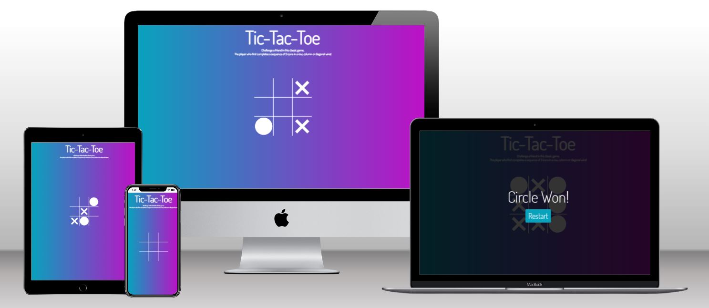
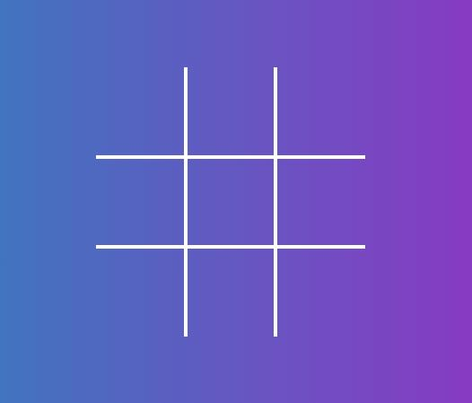
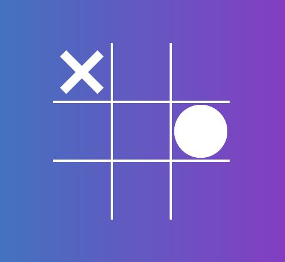
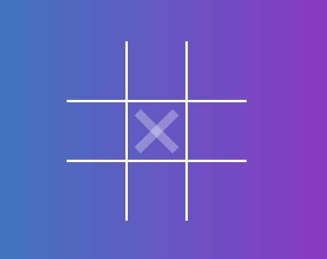
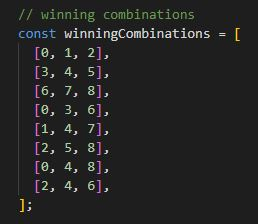
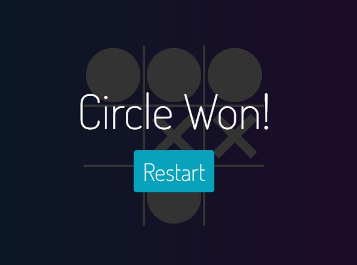
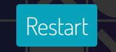
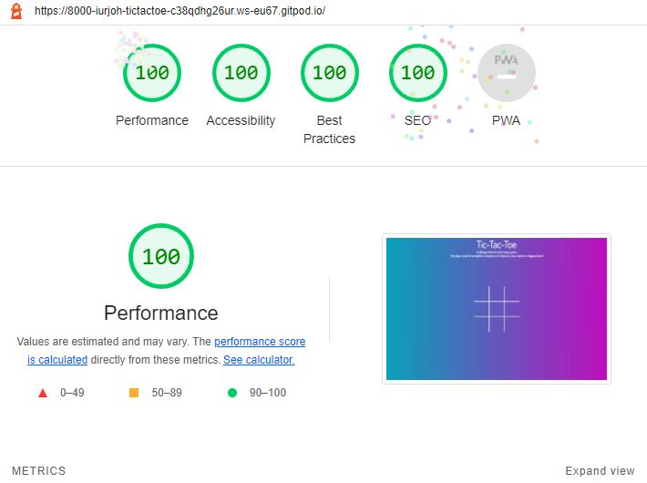

# Tic-Tac-Toe game

Play the game [here](https://iurjoh.github.io/Tic-tac-toe/)

This game is designed to test JavaScript and DOM basic skills acquired in the Code Institute's Full Stack developer course. The classic Tic-tac-toe was chosen, built in a simple and minimalist design, to be played online between two players.

# Features
## Existing Features
### Title

A title with a clean design to introduce users to the game.

### Instructions

A brief description of how to play this classic game.

### Board

In this area the game itself develops. A grid composed of 9 cells arranged in a 3x3 matrix responsive to the user's click, marking one cell at a time with the icon of the player who is active on the turn.

### Cells

After the move, the icon will change so that the next player/computer also makes his move. Each cell can only be clicked once and when the pointer passes over an already filled cell a prohibited sign will appear to indicate to the player that this cell is not available for a possible move.

### Hover Function

A hover has also been added to indicate to the current player which icon will be used to fill the cell for that turn. An image of the icon will appear over the cells available to the user whenever the pointer is moved over a cell that meets this criterion.

### End Game Rules

The game will end when one of the players manages to complete a complete row, column or diagonal or when all the cells are filled without one of the players achieving this victory condition, which will cause a tie.

- #### Conditions of a Victory

A string containing all possible combinations for the winning conditions was written and is used each turn to check if one of the players has managed to fulfill some of the 8 possible combinations that guarantee victory.

- #### Conditions of a Draw

Whenever all cells are filled without any player achieving a win condition, the game will end in a tie.

### End Game Messages

A message will be presented on the screen to the user containing one of the two options, be it a win or a draw. After this message is displayed, the user can choose to restart a new game by clicking on the restart button.

### Restart Button

At the end of each game, on the screen that shows the end game message, the player will be presented with a restart button that will reset the board, erasing all the icons that filled the cells, restarting the tie and victory conditions in a brand new match.

## Features to Increment
- Add a vs. CPU mode to play against the computer.
- Add more competitiveness to the game with an accumulative score display that will be updated at each end of the match.
- Add a mode with a countdown timer for each player's move, where if the time runs out, the player will lose his turn or have his move made by the computer.
- Add a stopwatch to show the elapsed time in each match.
- Add a game mode that saves wins in record time.

# Tests
To check for any possible bugs, code errors, warnings, performance, accessibility, best pratices and SEO, many tests were carried out in HTML, CSS and JavaScript using the following respective validators:
- W3C HTML Validator
- W3C CSS Validator (Jigsaw)
- JSHint JavaScript Validator
- Lighthouse validation test

## HTML Results

The HTML was successful in the validation test as shown in the image below.

## CSS Results

The CSS was successful in the validation test as shown in the image below.

## JavaScript Results

The JavaScript was successful in the validation test as shown in the image below.

## Lighthouse Results

The Lighthouse was successful in the validation test as shown in the image below.

## Fixed Bugs
- Fixed hover function when switching between icons between turns.

# Languages Used
- [HTML5](https://en.wikipedia.org/wiki/HTML5)
- [CSS3](https://en.wikipedia.org/wiki/CSS)
- [JavaScript](https://en.wikipedia.org/wiki/JavaScript)

# Deployment
This game was deploy through the GitHub repository. The steps are as follows:
- In the GitHub repository, click on Settings tab;
- Navigate to the menu on the left side and select Pages;
- Set the source in the Build and deployment item as "Deploy from a branch". Then, in the Branch item, the Main option was chosen, /(root) folder and finishing the settings with the Save button.

The link to the deployed website is: https://iurjoh.github.io/Tic-tac-toe/

# Credits
Here will be the sites that helped me find everything I needed to develop my work, including research and material sources.

## Content

Sites such as:
- [Stack Overflow](https://stackoverflow.co/) were used at various times to clear up recurring doubts,
- [Google Fonts](https://fonts.google.com/) to insert new fonts;
- [CSS Tricks](https://css-tricks.com/) to answer CSS questions;
- [Code Institute](https://learn.codeinstitute.net/) to review material of study explanatory videos and guides on how to set up a complete website;
- [GitHub](https://github.com/) to better understand other projects;
- [Google](https://www.google.com) for more information on subjects related to the that I had to study during the creation of the site;
- [W3C](https://www.w3.org/) to read the tutorials and understand basic rules of HTML, CSS and JavaScript;
- [Youtube](https://www.youtube.com/) tutorials to learn using in a practical way some of the methods necessary to implement the desired functions for the game;
- [Slack](https://slack.com/) communities to ask questions and access answers to questions that I found in the development of the site.

## Media

- [Techsini](https://techsini.com/multi-mockup/index.php) Multi Device Website Mockup Generator was used to generate the image used in this README.md in the opening section.

## Acknowledgements
- My mentor for continuous helpful feedback.
